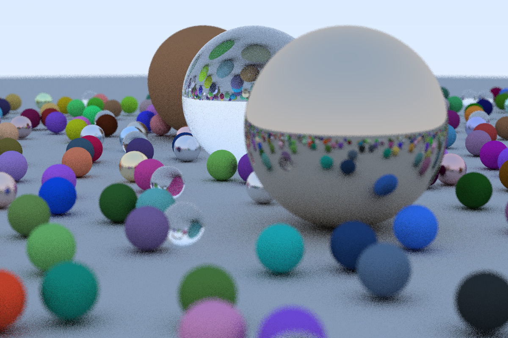
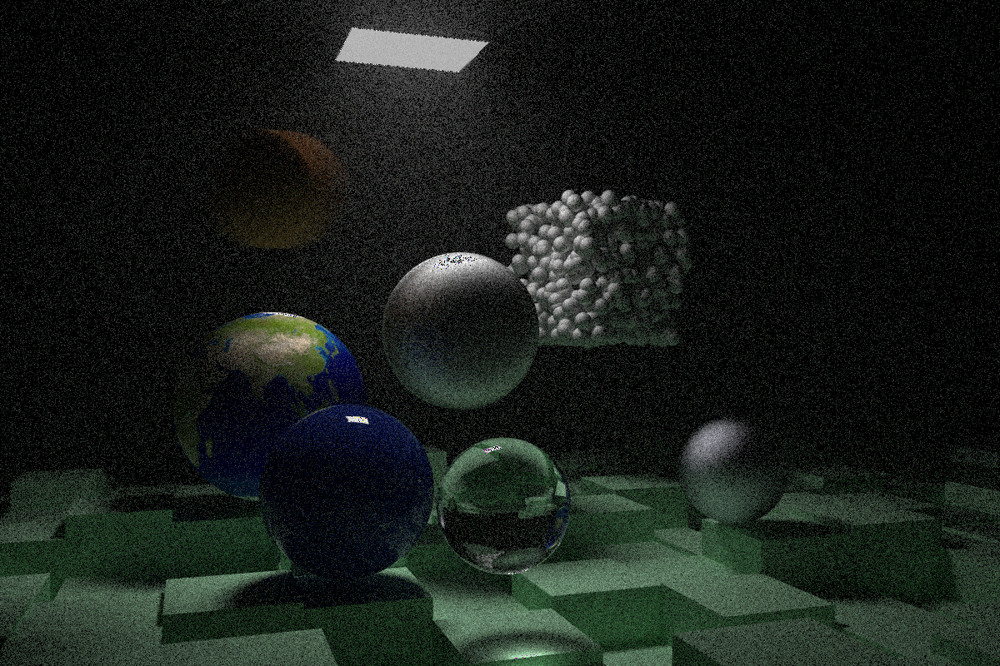

# Ray-Tracer

A ray-tracer based on the [excellent ray-tracing series of books](https://github.com/RayTracing/raytracing.github.io) by Peter Shirley. This project is a work-in-progress and is being implemented to learn about PBR in greater detail. (This repo will be updated accordingly, as and when I read more on specific topics or if I find something interesting)

## Current features :
- Basic anti-aliasing
- Diffuse, metal, dielectric, emitter materials 
- Basic camera implementation
- Depth of field
- Motion blur
- Basic BVH implementation
- Textures (external images + experimenting with noise functions)
- Instancing (rotations and translations)
- Simple volumetric media

  
    
    [LEFT]
    Original resolution of rendered image : 1200 x 800 with 10 spp. 
    Scene taken from the book :- Ray-Tracing in one weekend
    [RIGHT]
    Original resolution of rendered image : 1200 x 800 with 500 spp. 
    Scene taken from the book :- Ray-Tracing: The Next Week

