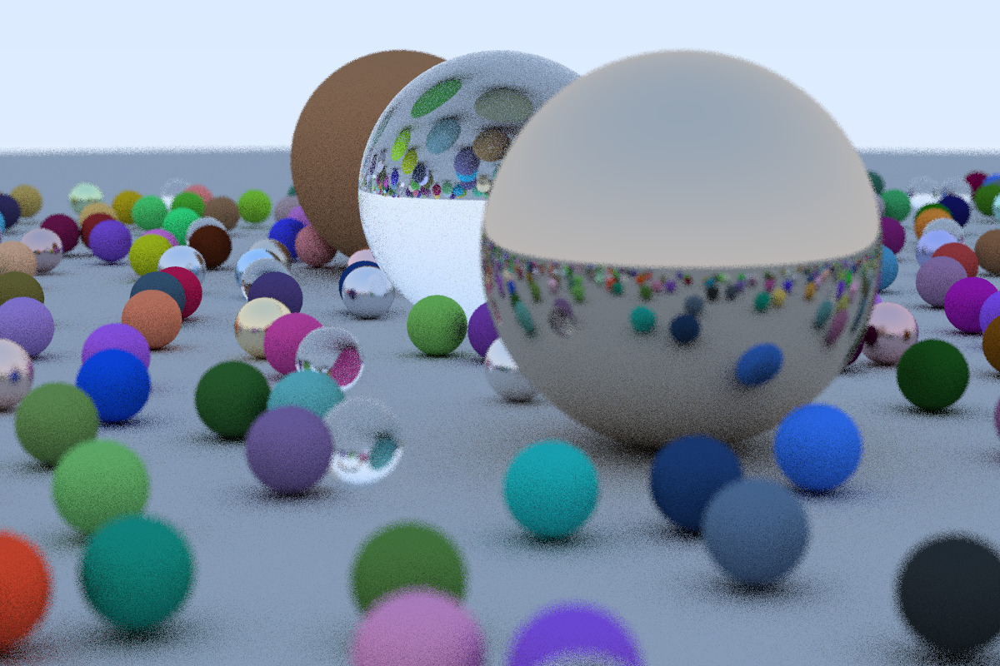

# Ray-Tracer

A ray-tracer based on the [excellent ray-tracing series of books](https://github.com/RayTracing/raytracing.github.io) by Peter Shirley. This project is a work-in-progress and is being implemented to learn about PBR in greater detail. (This repo will be updated accordingly, as and when I read more on specific topics or if I find something interesting)

## Current features :
- Basic anti-aliasing
- Diffuse, Metal and Dielectric materials
- Basic Camera implementation
- Depth of field

## To-do (Work-in-Progress) : 
- Multiple-lights
- Waveform obj loader for model/scene creation
- Texture-mapping (Surface and Solid textures)
- Different shapes for intersecton tests
- Volumetric media
- De-noiser
- CPU multithreading (OpenMP or inherent C++ thread library)
- GPU multithreading (CUDA)
- Window manager (GLFW / SDL) with a basic GUI (ImGui)

    Original resolution of rendered image : 1200 x 800 with 10 spp. 

